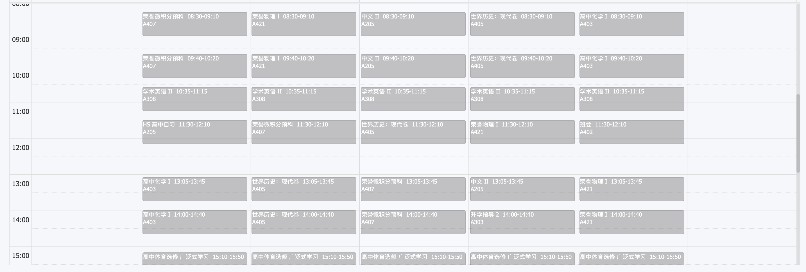

# real-schedule
> An API for retrieving real THISDL schedules
---

As you can see, the schedule on the Xiaobao system is incorrect, for example:

The class that was actually scheduled for the first period in the afternoon was shown as the last period in the morning.
This API corrects that.
## Usage
This API provide a endpoint `https://rs.api.thisdlit.com/high_school`
You can use it just like using `https://thisdlstu.schoolis.cn/api/Schedule/ListScheduleByParent`
